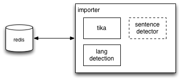
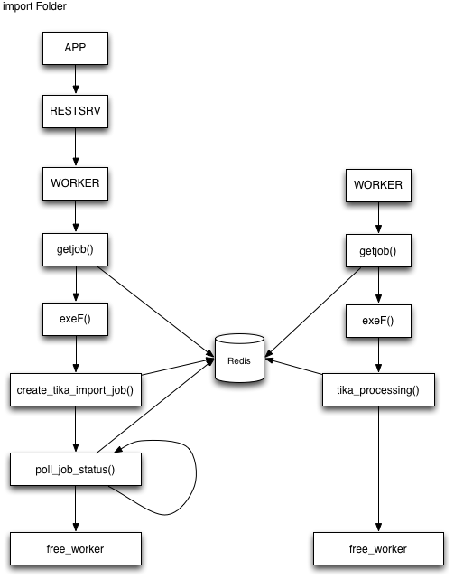
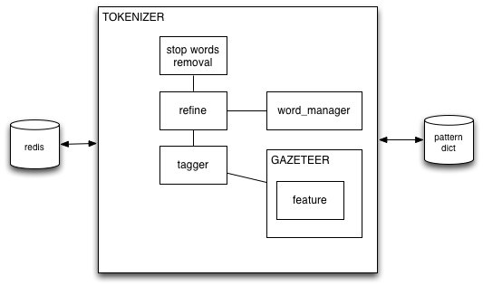

# Information Retrivial 

## Indexing workflow

### Importer

data:

	[ "filesys-single",
	  "/Users/alexr/test_docs/test0.pdf",
	  "redis" ]

data:

	[ "filesys-folder",
	  "/Users/alexr/test_docs/",
	  "redis" ]
	  

	docdata:doc_hash:tokenize_status  = { filename: xxx,
    				                      import_date: xxx,
                                          lang: xxx,
                                          text_data : xxx,
                                          num_doc_tokens : xxx }
    doc_to_tokenize = (hash0, ...)

                                         

	[list] wd:word:lang = ['doc_hash|wordfreq', ...]
	

	[list] wdmain:word:lang:feature:status = [pos, ...]

    [list] wdenita:word =[word,...]

