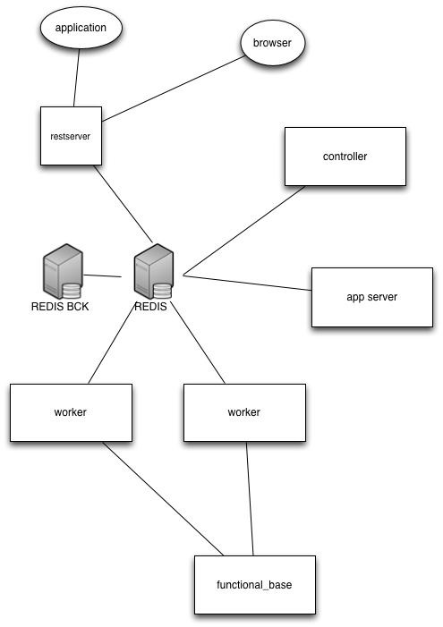
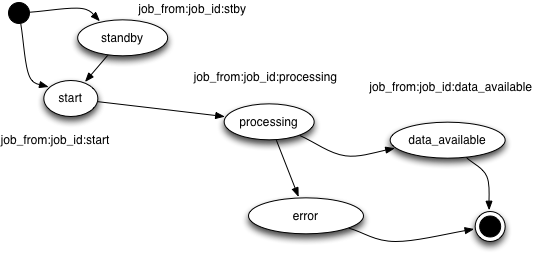
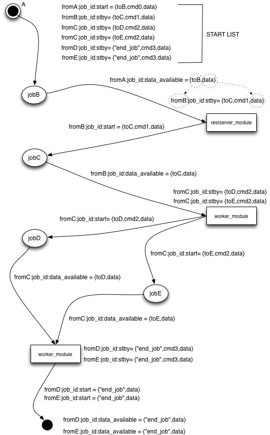
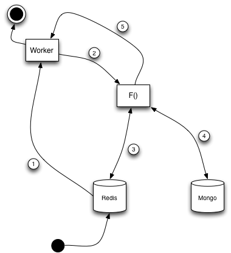
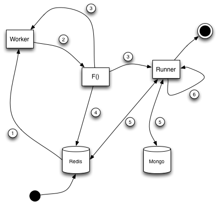
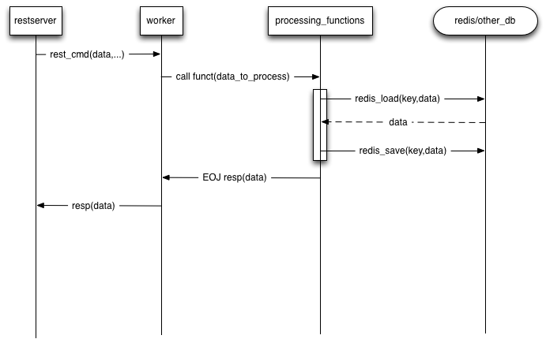

# ExeSys Documentazione #

System components are:

* Environment
* Bootstap
* Rest server
* Controller
* Worker
* Application servers

### Environment
Set up configs and globals.

### Bootstap
To start system exe script: ../ExeSys/start_exe_sys.sh

### Rest server
Load ans set commands

ex to start an job:

	curl -H "Content-type: application/json" \
	-X POST http://127.0.0.1:5000/sys_cmd -d \
	'{"from":"testclient",\
	"to:","testjob",
	"cmd":"test_cmd",\ 
	"data": "senatoremonti",\
	"job_id":"16fd2706-8baf-433b-82eb-8c7fada847da"\
	}'

command structure:
	{
	 'from':'xxx',
	 'job_id':,'uid'
	 'to':'xxx',
	 'cmd':'xxx',
	 'data':'xxx', <-pickled
	}

Redis holds system state, processes and data.

Redis data format:

key from:job_id:status == {
                           'to':'xxx',
                           'cmd:'xxx', 
                           'data':'xxx'
                           }
Possible system states:

* 0 == start
* 1 == standby
* 2 == processing
* 3 == data_available
* 4 == error 

                 

To recall data just resend the original message with the same job_id.

    from:job_id:data_available={ "to":"end_job",
                                 "result":[…] }

### Controller
Manages timerized tasks and asynch logigs.

### Worker
Job exe subsystem.  

Every job has a 'function' taken from the ExeSysFunctionalModules directory 

### Webserver
Local test webserver fro static pages.

### Execution flow

Only direct graphs.

Every job starts with:"start_job" and end with :"end_job".

complex workflow request ex. :

	curl -H "Content-type: application/json" \
		-X POST http://127.0.0.1:5000/sys_cmd -d \
		-H "Operation: workflow" \
		'{"from":"testclient",\
		"to:","testjob",
		"cmd":"test_cmd",\ 
		"data": "senatoremonti",\
		"job_id":"16fd2706-8baf-433b-82eb-8c7fada847da"\
		}'

whe job ended results are hold by dict:

	dict
	 { 
	  'EOJ': <result data>
	 } 

I worker possono eseguire le funzioni in due modalità:

***Single run***

	1- Worker get job from redis key
	2- in 'cmd' field there is the function  f to execute
	3- f read and writes data in redis
	4- f read and writes data  mongodb
	5- f exits

***Forever run***

La funzione lancia un runner che rimane in esecuzione finchè in redis non viene caricato da un single run lo stop.

  1- Worker get job from redis key
	2- in 'cmd' field there is the function  f to execute
	3- f spawns a runner
	4- f read and writes data in redis
	5- f read and writes data  mongodb
	6- f exits

	  
### Data flow

